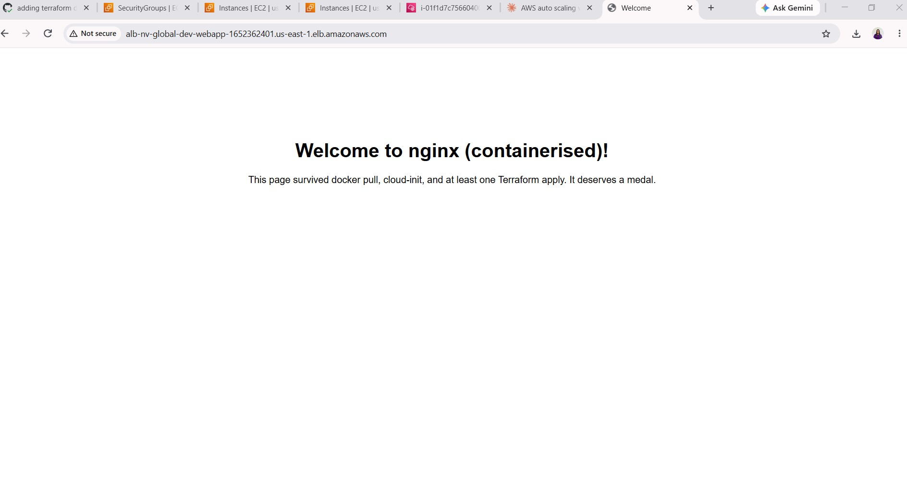

# AWS Auto Scaling Web Demo



A highly available NGINX web application deployed on AWS with Terraform. The application runs in Docker containers on private EC2 instances managed by an Auto Scaling Group and is exposed through a public Application Load Balancer.

## Architecture

```text
Internet
	 |
Public Application Load Balancer
	 |
Private subnets in multiple Availability Zones
	 |
EC2 Auto Scaling Group running the NGINX container
```

Terraform creates:

- A VPC with public and private subnets across two Availability Zones.
- Internet access for public resources and NAT access for private instances.
- Security groups for the ALB and application instances.
- An Application Load Balancer and HTTP listener.
- A launch template and Auto Scaling Group for the NGINX application.

The default deployment uses HTTP. HTTPS and Route 53 ACM validation resources are implemented in the applications module but are currently disabled in `infrastructure/main.tf`.


## Repository Layout

```text
.
├── infrastructure/
│   ├── main.tf                 # Root module composition
│   ├── dev.tfvars              # Development environment values
│   ├── providers.tf            # AWS provider and S3 backend
│   ├── modules/
│   │   ├── vpc/                # Network resources
│   │   └── apps/               # ALB, ASG, security groups, and ACM
│   └── docker/                 # NGINX image source
└── .github/workflows/          # CI, deployment, and destroy workflows
```

## Prerequisites

- AWS account with permission to create the resources in `infrastructure/`.
- Terraform compatible with the AWS provider constraint `~> 6.0`.
- AWS OIDC IAM Role configured for CI for secure authentication.
- An existing S3 bucket for Terraform state. State locking uses the S3 backend lockfile feature.


## GitHub Actions

The `dev` workflow runs for pushes to `main`, pushes to `feature/**`, and pull requests that change `infrastructure/` or the workflows.

The deployment pipeline:

1. Formats and validates the Terraform configuration.
2. Builds and pushes the Docker image to GHCR on deployment pushes.
3. Initializes the S3 backend and creates a Terraform plan.
4. Applies the saved plan for the development environment.

Configure these repository or environment secrets before enabling deployment:

| Secret | Purpose |
| --- | --- |
| `AWS_ROLE_ARN` | IAM role assumed through GitHub OIDC |
| `AWS_TFSTATE_BUCKET` | S3 bucket used for Terraform state |
| `AWS_DEFAULT_REGION` | AWS region, currently `us-east-1` |

The IAM role should trust the repository's GitHub Actions OIDC identity and have permissions for the Terraform-managed resources, the state bucket, and any required lockfile operations.

To destroy the development environment, manually run the `Destroy Infrastructure` workflow. It requires selecting `dev` and entering `dev` as the confirmation value.

## How to Destroy Infrastructure

### GitHub Actions

The recommended method is the protected `Destroy Infrastructure` workflow:

1. Open the repository's **Actions** tab.
2. Select **Destroy Infrastructure**.
3. Click **Run workflow**.
4. Select `dev` as the environment.
5. Enter `dev` exactly in the confirmation field.
6. Click **Run workflow** again.

The workflow first verifies that the confirmation text matches the selected environment. It then authenticates to AWS through GitHub OIDC, initializes the S3 backend, creates a `terraform plan -destroy`, and applies that destroy plan automatically. This removes the Terraform-managed VPC, networking, load balancer, Auto Scaling resources, and related application resources for the selected environment.

Do not start a destroy run while another plan or apply is modifying the same state. Confirm that the correct AWS account, region, environment, and state bucket are selected before running it. The destroy action is permanent; data or resources created outside this Terraform state are not removed automatically.

### Local Terraform

From the `infrastructure` directory, configure AWS credentials and initialize the same backend used by the environment:

```bash
terraform init \
	-backend-config="bucket=<terraform-state-bucket>" \
	-backend-config="key=nginx-webapp/infrastructure-core/dev/terraform.tfstate" \
	-backend-config="region=us-east-1"
```

Create and review a destroy plan:

```bash
terraform plan -destroy \
	-var-file=dev.tfvars \
	-var="env=dev" \
	-out=destroy.tfplan
```

Apply the reviewed destroy plan:

```bash
terraform apply destroy.tfplan
```

Use the saved plan so the resources reviewed during planning are the resources Terraform attempts to remove. Do not use `terraform destroy -auto-approve` unless you intentionally want to skip the review step.

## How to run Plan and Apply

### GitHub Actions

The reusable workflow always runs a Terraform plan. Apply job is optional and controlled by the `apply` input in `.github/workflows/dev.yml`:

```yaml
with:
  environment: dev
  apply: false # Plan only
```

Set `apply: true` to apply the saved plan after the plan job succeeds:

```yaml
with:
  environment: dev
  apply: true
```

The workflow saves the plan as the `tfplan-dev` artifact and the apply job downloads and applies that exact plan. Do not manually run `terraform apply` against a different plan if reviewing the workflow artifact.


### Local Terraform

Run these commands from the `infrastructure` directory after configuring AWS credentials and the S3 backend:

```bash
terraform init \
	-backend-config="bucket=<terraform-state-bucket>" \
	-backend-config="key=nginx-webapp/infrastructure-core/dev/terraform.tfstate" \
	-backend-config="region=us-east-1"

terraform plan \
	-var-file=dev.tfvars \
	-var="env=dev" \
	-out=tfplan
```

Review the proposed changes in the plan output. Apply the exact saved plan only after review:

```bash
terraform apply tfplan
```

To plan without creating or changing resources, use `terraform plan` without `terraform apply`. The plan may become stale if the state or configuration changes, so generate a new plan before applying when that happens.

## Container Image

The CI build uses `infrastructure/docker/Dockerfile` and publishes:

```text
ghcr.io/<repository-owner>/ha-nginx:latest
ghcr.io/<repository-owner>/ha-nginx:<commit-sha>
```

The Terraform development variables currently reference:

```text
ghcr.io/geemanthi/ha-nginx:latest
```

### Publish with GitHub Actions

The reusable workflow builds and publishes the image only when the caller sets `build: true`. Update the `dev` job in `.github/workflows/dev.yml`:

```yaml
with:
  build: true
```

The build job:

1. Checks out the repository.
2. Logs in to GitHub Container Registry (`ghcr.io`) using the automatically provided `GITHUB_TOKEN`.
3. Builds the image from `infrastructure/docker/Dockerfile`.
4. Publishes these tags:

```text
ghcr.io/<repository-owner>/ha-nginx:latest
ghcr.io/<repository-owner>/ha-nginx:<commit-sha>
```

The workflow requires `packages: write` permission, which is already declared in the workflow. On the first publish, the package may need to be made visible to the intended consumers in the repository's **Packages** settings.


## Configuration

Development values are stored in `infrastructure/dev.tfvars`, including the AWS region code, VPC CIDR, subnet CIDRs, and container image. Adjust the variable file for another environment and provide the matching `env` value when planning or applying.

The root module currently hardcodes the AWS provider region to `us-east-1` and keeps HTTPS disabled. Before enabling HTTPS, configure the domain and public Route 53 hosted zone required by the ACM validation resources.

## Resources

The following table uses the standard terraform-docs resource format. Resources marked as conditional are created only when their module inputs enable them.

| Name | Type | Description |
| --- | --- | --- |
| `module.vpc.aws_vpc.vpc` | `aws_vpc` | Main application VPC. |
| `module.vpc.aws_default_route_table.default_route_table` | `aws_default_route_table` | Default route table for the VPC. |
| `module.vpc.aws_main_route_table_association.default_route_table_association` | `aws_main_route_table_association` | Associates the default route table with the VPC. |
| `module.vpc.aws_route.default_route` | `aws_route` | Default VPC route. |
| `module.vpc.aws_subnet.private_subnet` | `aws_subnet` | Private application subnets across Availability Zones. |
| `module.vpc.aws_route_table.private_route_table` | `aws_route_table` | Route tables for private subnets. |
| `module.vpc.aws_route_table_association.private_route_table_association` | `aws_route_table_association` | Associates private subnets with their route tables. |
| `module.vpc.aws_route.private_route` | `aws_route` | Routes private subnet traffic through the NAT gateway. |
| `module.vpc.aws_subnet.public_subnet` | `aws_subnet` | Public subnets for the ALB and NAT gateway. |
| `module.vpc.aws_route_table.public_route_table` | `aws_route_table` | Route tables for public subnets. |
| `module.vpc.aws_route_table_association.public_route_table_association` | `aws_route_table_association` | Associates public subnets with their route tables. |
| `module.vpc.aws_route.public_route` | `aws_route` | Routes public subnet traffic through the internet gateway. |
| `module.vpc.aws_eip.nat_eip` | `aws_eip` | Elastic IP for the NAT gateway. |
| `module.vpc.aws_nat_gateway.nat_gateway` | `aws_nat_gateway` | Outbound internet access for private subnets. |
| `module.vpc.aws_internet_gateway.internet_gateway` | `aws_internet_gateway` | Internet gateway for the VPC. |
| `module.vpc.aws_default_security_group.default_security_group` | `aws_default_security_group` | Default VPC security group. |
| `module.vpc.aws_security_group.aws_internet_egress` | `aws_security_group` | Egress security group for internet access. |
| `module.apps.aws_lb.nginx` | `aws_lb` | Public Application Load Balancer. |
| `module.apps.aws_lb_target_group.nginx` | `aws_lb_target_group` | HTTP target group for the NGINX instances. |
| `module.apps.aws_lb_listener.http` | `aws_lb_listener` | HTTP listener that forwards traffic or redirects to HTTPS. |
| `module.apps.aws_lb_listener.https` | `aws_lb_listener` | Conditional HTTPS listener using the ACM certificate. |
| `module.apps.aws_launch_template.nginx` | `aws_launch_template` | Launch configuration for NGINX EC2 instances. |
| `module.apps.aws_autoscaling_group.nginx` | `aws_autoscaling_group` | Maintains the desired number of application instances. |
| `module.apps.aws_security_group.alb` | `aws_security_group` | Security group for the public ALB. |
| `module.apps.aws_security_group.instance` | `aws_security_group` | Security group for application instances. |
| `module.apps.aws_acm_certificate.web` | `aws_acm_certificate` | Conditional ACM certificate for the application domain. |
| `module.apps.aws_route53_record.cert_validation` | `aws_route53_record` | Conditional DNS record used for ACM validation. |
| `module.apps.aws_acm_certificate_validation.web` | `aws_acm_certificate_validation` | Conditional ACM certificate validation. |
| `module.apps.aws_route53_record.app` | `aws_route53_record` | Conditional DNS alias pointing the domain to the ALB. |


## Why I Chose AWS Over Azure?

- Mature pattern: AWS ALB + Auto Scaling Group + Launch Template is a well-established AWS setup and is easy to build with Terraform.
- Better Terraform support: The AWS Terraform provider is mature, well-documented, and has lots of community examples.
- Free tier: A small setup with 2 t3.micro instances and an ALB is suitable for a lightweight demo and can stay very low-cost.
- Familiarity: I’m more familiar with AWS, so I can build and verify the setup more reliably.

## Assumptions

- AWS resources are deployed in `us-east-1`.
- The AWS account and GitHub OIDC role have permission to create and destroy the Terraform-managed resources.
- The S3 bucket used for Terraform state already exists and supports the S3 backend lockfile feature.
- `dev` is the active development environment.
- The container image `ghcr.io/geemanthi/ha-nginx:latest` is available to the EC2 instances.
- GitHub Actions has the required `AWS_ROLE_ARN`, `AWS_TFSTATE_BUCKET`, and `AWS_DEFAULT_REGION` environment secrets.
- HTTPS is disabled, so application traffic currently uses HTTP through the ALB.
- Destroy operations remove only resources tracked in this Terraform state; externally created resources are not removed.

## Cost

Estimated AWS cost for the development deployment in **US East (N. Virginia), `us-east-1`**:

| Service | Upfront cost | Estimated monthly cost |
| --- | ---: | ---: |
| Elastic Load Balancing | $0.00 | $22.27 |
| Amazon EC2 | $0.00 | $19.98 |
| Amazon VPC | $0.00 | $66.19 |
| **Total** | **$0.00** | **$108.44** |

### Estimate Details

#### Elastic Load Balancing

- Application Load Balancers: 1
- Region: US East (N. Virginia)
- Processed bytes (EC2 Instances and IP addresses as targets) - 1GB/hour

#### Amazon EC2

- Operating system: Linux
- Tenancy: Shared Instances
- Instance type: `t3.micro`
- Number of instances: 2
- Workload: Consistent, 100% On-Demand utilization per month
- Monitoring: Disabled
- EBS storage: 30 GB
- Data transfer assumptions: 0 TB inbound, outbound, and intra-region

#### Amazon VPC

- NAT gateways: 1 regional NAT gateway active in 1 Availability Zone
- Internet inbound data transfer: 10 GB per month
- Internet outbound data transfer: 0 TB per month
- Intra-region data transfer: 0 TB per month


